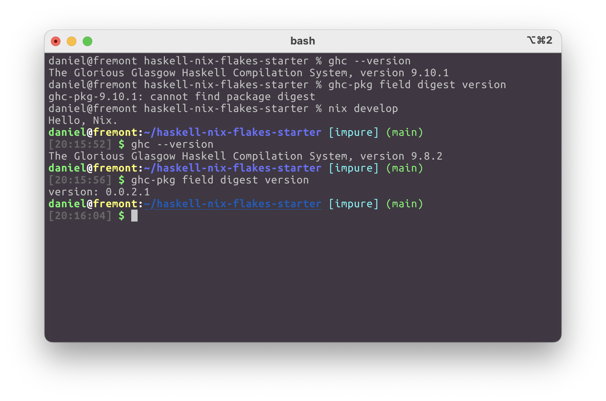
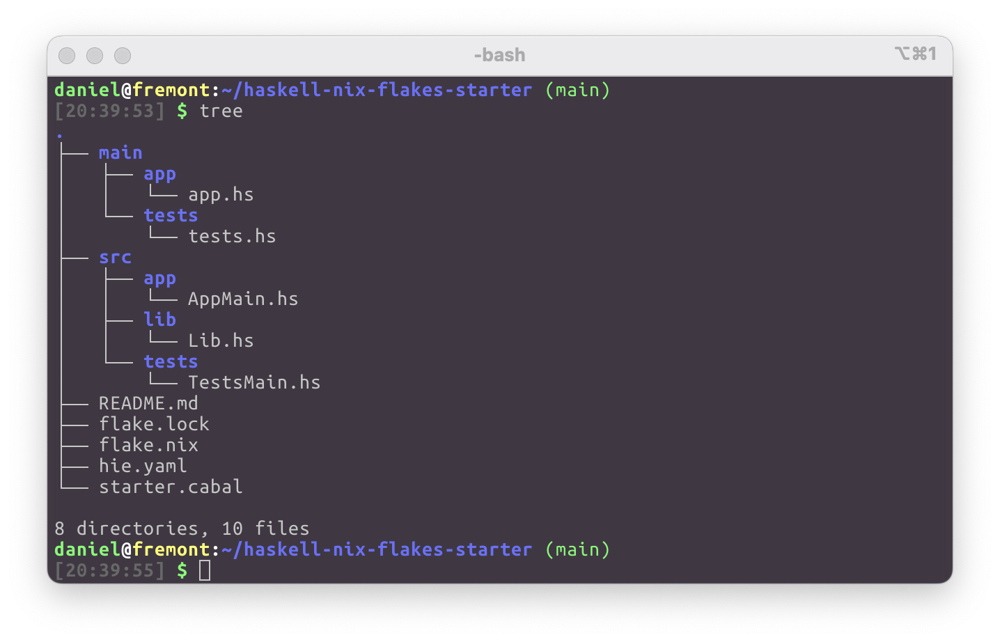

# Haskell Nix Flakes Starter

Starter Haskell project using Nix flakes to manage Haskell dependencies and tools.


## What this does

This repository includes a file, `flake.nix`, which defines a developer shell specifically tailored for the project.
Running the command `nix develop` will start a Bash shell that includes all the required build tools and libraries at the correct versions.

This way:
- onboarding new contributors is fast and repeatable,
- you always have the correct versions of your build tools, and
- you know the exact versions of all of your library dependencies.




## Get Nix

Nix is a programming language, build tool, and package ecosystem.
Define declarative builds and deployments in the Nix language, and execute them reproducibly using Nix.

https://nixos.org/download/


## How to add dependencies

Add Haskell package dependencies, development tools, and even C libraries in the indicated places in `flake.nix`.
Then refresh the Nix shell by exiting (if you are in one) and running `nix develop`.


## What about editor integrations

On Linux, simply launch your editor from inside the Nix development shell.
Your editor will then have access to all the same environment defined in Nix shell.

On Macos, the story is a little bit different.
Mac GUI applications do not inherit the environment of the invoking shell.
To get around that, the Nix shell executes a `shellHook` that symlinks your build tools into `./.dev/bin` so that you can reference those tools in your editor config.

In addition to that, there's still a big more configuration that Haskell Language Server relies on.
Below is how I got it to work with VS Code.

This repo includes `.vscode/settings-template.json`.
Keep this file, but make a copy it to your own VS Code settings.
You may then modify your `.vscode/settings.json` however you like.
Finally enter the Nix development shell.

```console
$ cp .vscode/settings-templates.json .vscode/settings.json
$ code .vscode/settings.json # get all your settings just right...
$ nix develop
```

Entering the Nix development shell will merge the correct Haskell Language Server config into your `.vscode/settings.json`.

Integrations for other editors can be similarly implemented by modifying `shellHook` in `flake.nix`.


## Why the strange project structure?

This repo is structured a bit idiosyncratically for a Haskell project.



- `main` consists of directories corresponding to the executable Cabal components (`executable`s, `test-suite`s, and `benchmark`s) defined in `starter.cabal`.
  - Each directory consists of a single Haskell file, which does nothing but re-export a `main` imported from one of the `other-modules` of its Cabal component.
- `src` consists of directories corresponding to the Cabal components defined in `starter.cabal`.
  - For library components, the directory contains the component's `exposed-modules`.
  - For executable components, the directory contains the component's `other-modules`.

This project structure allows us to avoid using `hpack`, instead realying on `cabal-fmt` to populate our `exposed-modules` and `other-modules` fields.

For simplicity, library components expose all of their modules.
Use an internal library to hide modules from downstream users.

There is one component, `lib:dev` that does not follow these conventions.
Instead, it includes all Haskell files in the `src` directory.
This greatly simplifies the use of tools such as GHCi and Haskell Language Server.

```cabal
name: starter

library prim
  hs-source-dirs: src/prim

library
  hs-source-dirs: src/lib
  build-depends: prim

executable app
  hs-source-dirs: src/app main/app
  main-is: app.hs
  build-depends: prim, starter

test-suite tests
  hs-source-dirs: src/tests main/tests
  main-is: tests.hs
  build-depends: prim, starter

library dev
  hs-source-dirs: src/app src/lib src/tests
```
